# AWS S3 Inventory Analytics with Athena

## Overview
This project demonstrates a **cost-aware, production-style Amazon S3 data management and analytics setup** using:

- **Amazon S3** (raw, processed, logs, Athena results)
- **S3 Server Access Logging**
- **S3 Versioning**
- **S3 Lifecycle Rules**
- **S3 Inventory**
- **Amazon Athena** for querying inventory data

The goal is to show **how to manage, audit, and analyze S3 objects** without waiting for long inventory generation cycles that could increase costs.

> **Cost note**:  
> To avoid unnecessary costs and delays, this project does **not wait for the weekly S3 Inventory export** to complete. Instead, the architecture and Athena integration are fully validated and ready for analysis.

---

## Repository Name (Suggested)
**`aws-s3-inventory-athena-analytics`**

---

## Architecture Buckets

| Bucket Name | Purpose |
|------------|--------|
| `devops-s3cap-raw` | Raw objects |
| `devops-s3cap-processed` | Processed objects |
| `devops-s3cap-logs` | Server access logs |
| `devops-s3cap-athena-results` | Athena query results |

---

## Step-by-Step Configuration

### 1. S3 Buckets Created
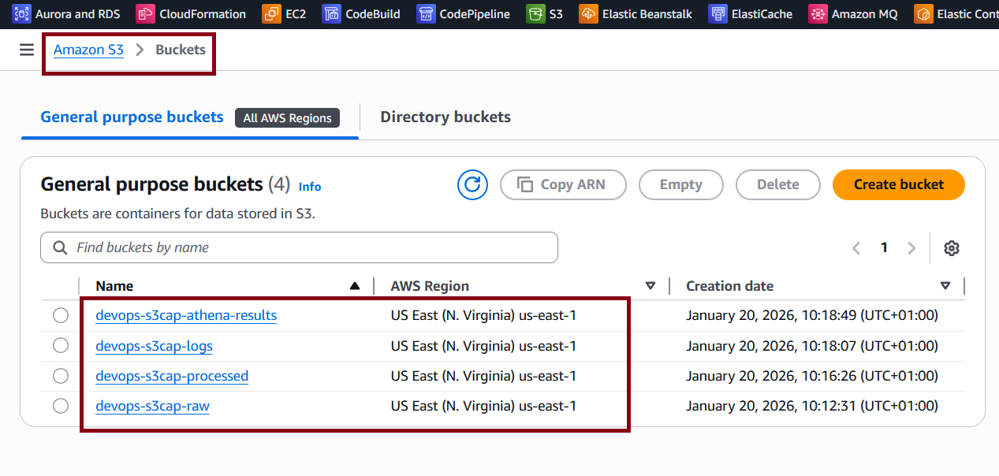

---

### 2. Server Access Logging (Raw Bucket)
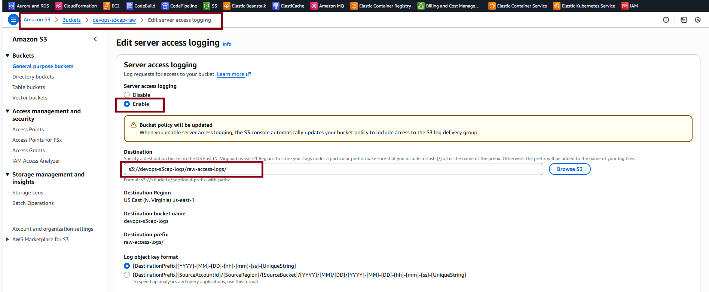

---

### 3. Raw Bucket Folder Structure
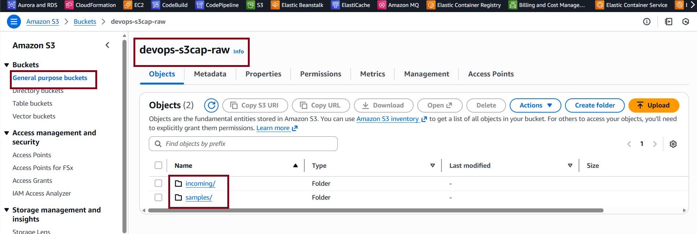

---

### 4. Server Access Logging (Processed Bucket)
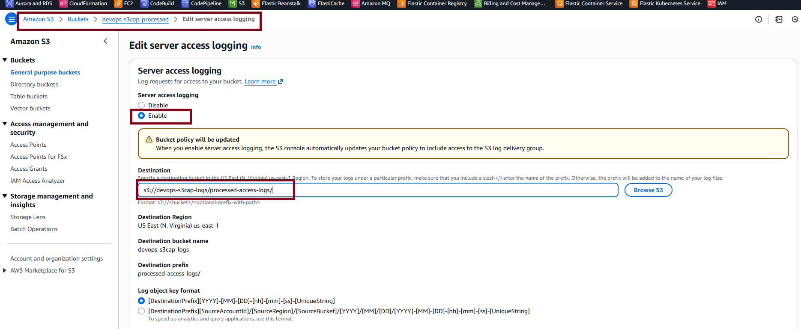

---

### 5. Versioning Enabled (Raw Bucket)
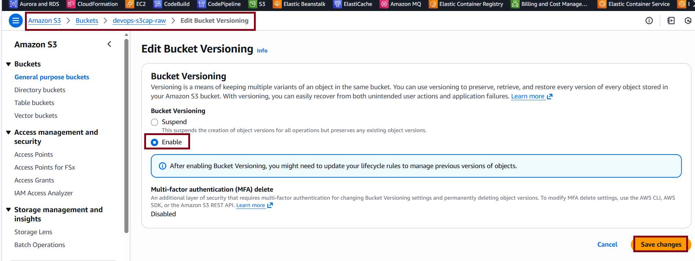

---

### 6. Versioning Enabled (Processed Bucket)
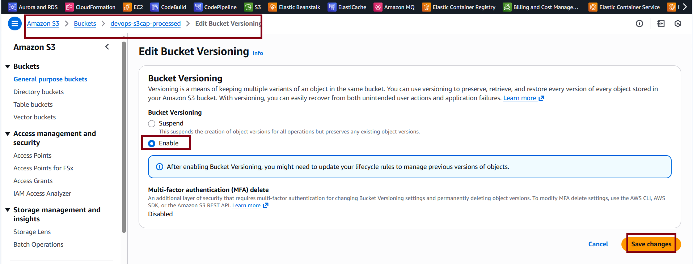

---

### 7. Multiple Object Versions (Raw Bucket)
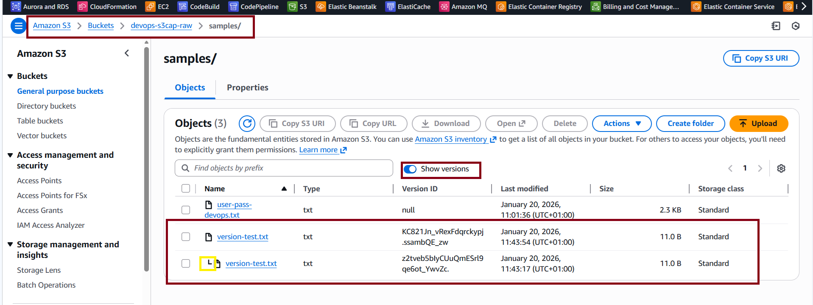

---

### 8. Enforce HTTPS Only (Raw Bucket Policy)
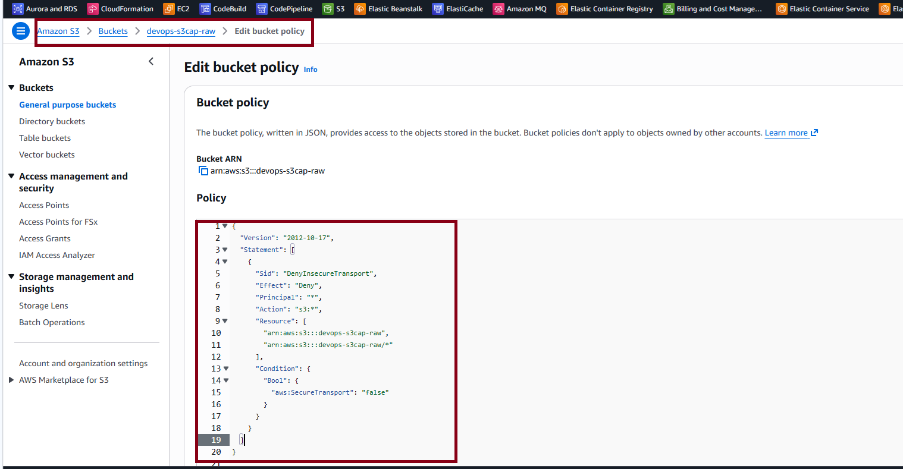

---

### 9. Enforce HTTPS Only (Processed Bucket Policy)
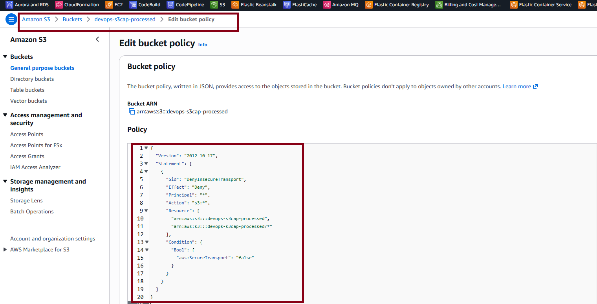

---

### 10. Lifecycle Rule – Raw Bucket
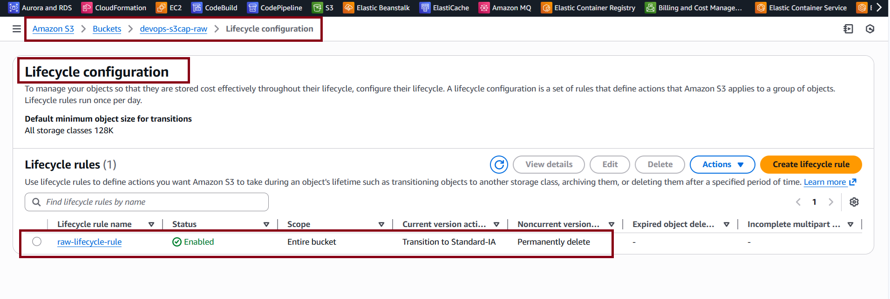

---

### 11. Lifecycle Rule – Processed Bucket
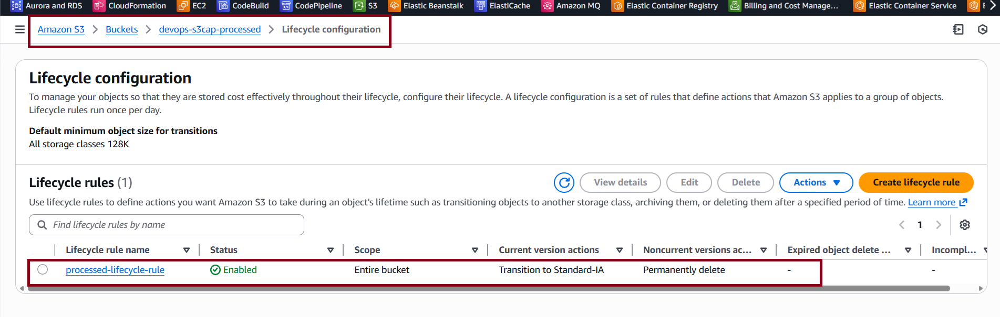

---

### 12. S3 Inventory Configuration – Raw Bucket
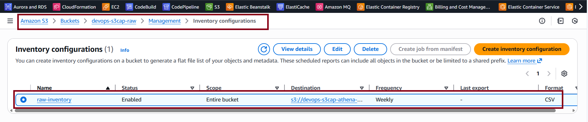

---

### 13. S3 Inventory Configuration – Processed Bucket
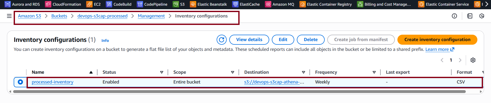

---

## Athena Integration

### 14. Athena Query Results Location
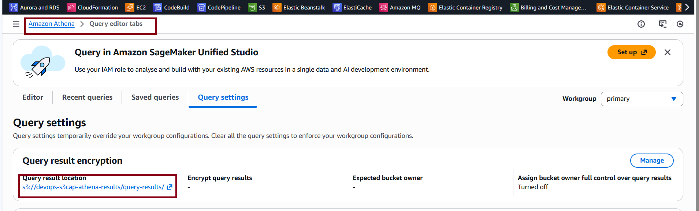

---

### 15. Create Athena Database
```sql
CREATE DATABASE s3cap_inventory;
```
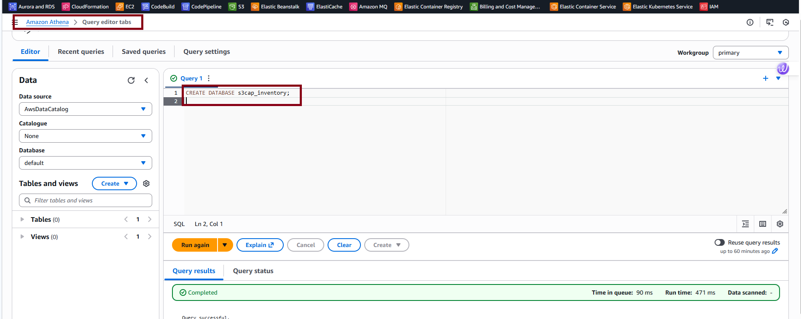

---

### 16. Create External Table for S3 Inventory
```sql
CREATE EXTERNAL TABLE IF NOT EXISTS s3cap_inventory.raw_inventory (
  bucket string,
  key string,
  version_id string,
  is_latest boolean,
  is_delete_marker boolean,
  size bigint,
  last_modified_date timestamp,
  e_tag string,
  storage_class string
)
ROW FORMAT SERDE 'org.apache.hadoop.hive.serde2.OpenCSVSerde'
WITH SERDEPROPERTIES (
  'separatorChar' = ',',
  'quoteChar' = '"'
);
```
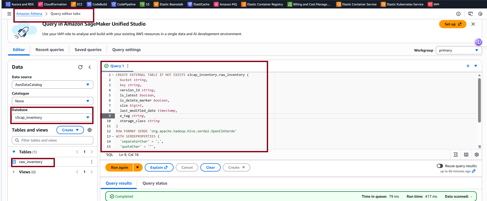

---

### 17. Athena Query Results Stored in S3


---

## Example Lightweight Analytical Query
```sql
SELECT storage_class, COUNT(*) AS object_count
FROM raw_inventory
GROUP BY storage_class;
```

This query provides a **quick storage-class distribution** without scanning large datasets.

---

## Key Takeaways
- Secure S3 using **HTTPS-only bucket policies**
- Reduce cost using **Lifecycle rules**
- Track object changes with **Versioning**
- Audit access using **Server Access Logs**
- Analyze inventory metadata efficiently with **Athena**
- Avoid unnecessary cost by not waiting for full inventory cycles

---

## Status
Project setup complete and production-ready.

